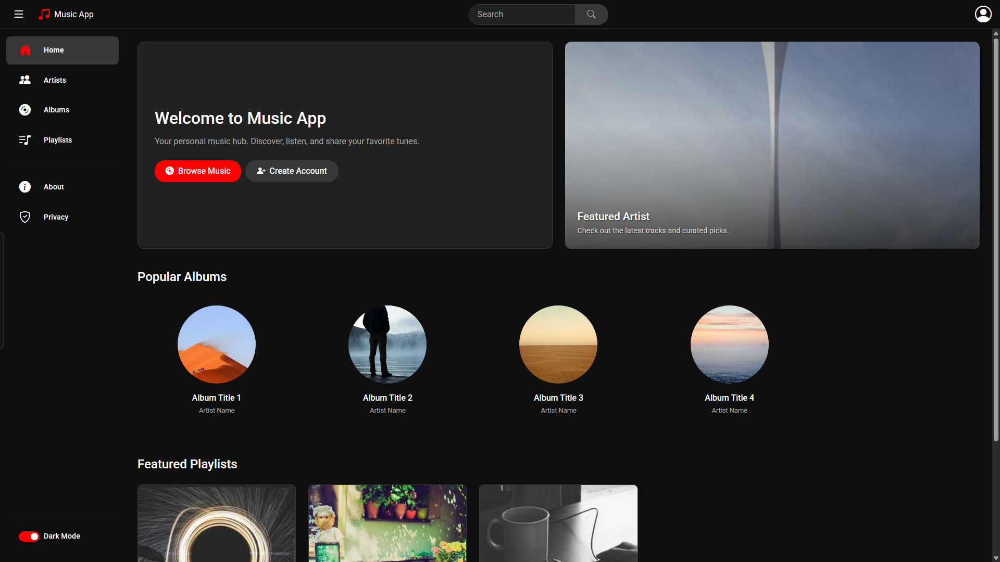
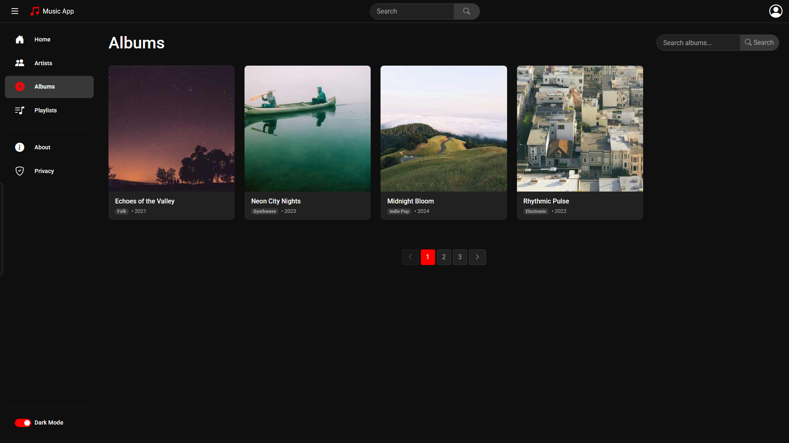
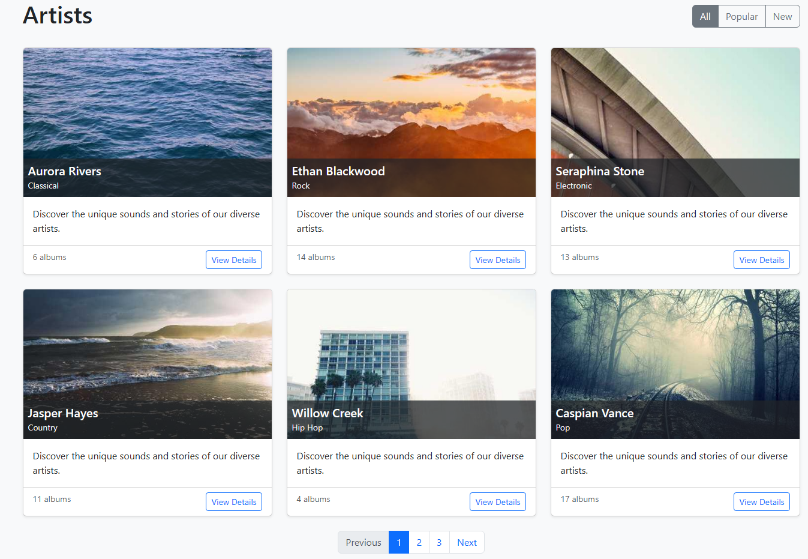
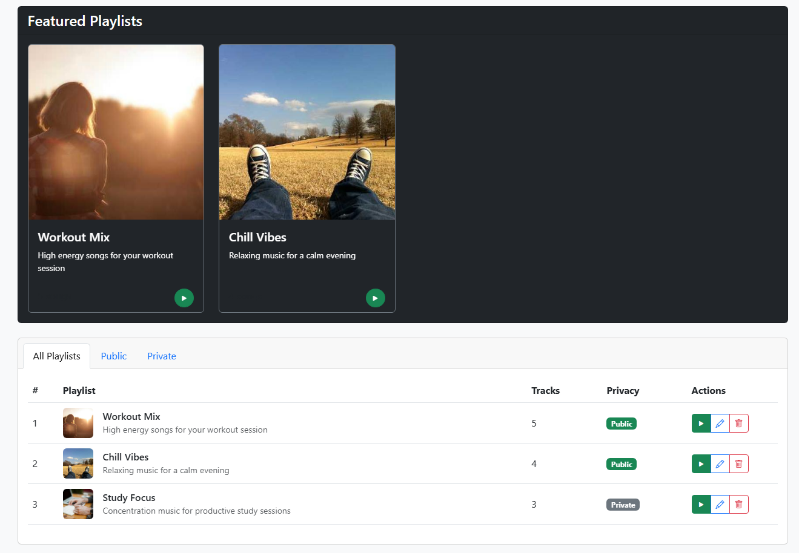
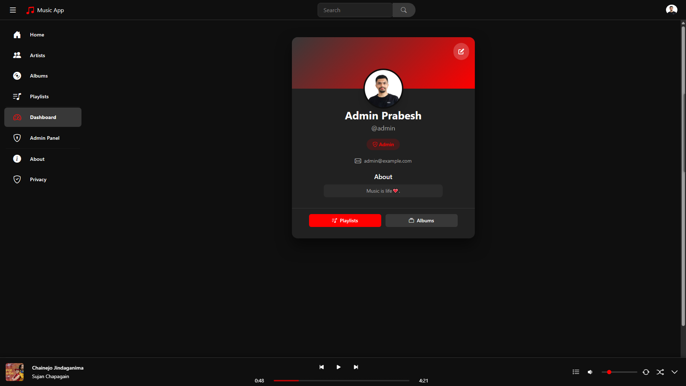

# Music App - Your Personal Music Hub

Welcome to **Music App**, a web application built with ASP.NET to provide a user-friendly interface for browsing and managing your music.  This project is currently focused on building the foundational UI and controller structure to create a seamless music experience.

## About

This Music App is a Computer Science project developed by **Prabesh Aryal** as part of the 3rd year, 2nd semester coursework for the Bachelor of Science in Computer Engineering program at Baku Engineering University (Class 1202i). It was submitted to **Vugar Cebiyev**.

-  **Developer:** Prabesh Aryal
- **University:** Baku Engineering University
- **Class:** 1202i, Computer Engineering Bsc
- **Website:** [https://prabe.sh](https://prabe.sh)
- **Email:** [hello@prabe.sh](mailto:hello@prabe.sh)
- **GitHub:** [prabeshAryal](https://github.com/prabeshAryal)

## Features (Currently in UI & Controller Stage)

*   **Home Page:**  Landing page of the Music App.
    
*   **Browse Albums:** Explore music albums.
    
*   **Browse Artists:** Discover music artists.
    
*   **Playlists:** Manage your personal music playlists.
    
*   **User Profile:** View and manage your profile.
    

## Project Structure

The project is organized as a standard ASP.NET MVC application:

```
MusicApp/
├── Controllers/
│   ├── HomeController.cs        # Handles landing page and general site info
│   ├── ArtistsController.cs      # Manages Artist related views and logic
│   ├── AlbumsController.cs       # Manages Album related views and logic
│   ├── PlaylistsController.cs    # Manages Playlist related views and logic
│   └── ProfileController.cs      # Manages User Profile related views and logic
├── Models/
│   ├── Artist.cs              # Data model for Artist
│   ├── Album.cs               # Data model for Album
│   ├── Song.cs                # Data model for Song
│   └── Playlist.cs            # Data model for Playlist
├── Views/
│   ├── Home/                  # Views for the Home Controller
│   │   ├── Index.cshtml       # Home page view
│   │   ├── About.cshtml       # About page view
│   │   └── Privacy.cshtml     # Privacy page view
│   ├── Artists/               # Views for the Artists Controller
│   │   ├── Index.cshtml       # List of Artists view
│   │   └── Details.cshtml     # Artist Details view
│   ├── Albums/                # Views for the Albums Controller
│   │   ├── Index.cshtml       # List of Albums view
│   │   └── Details.cshtml     # Album Details view
│   ├── Playlists/             # Views for the Playlists Controller
│   │   ├── Index.cshtml       # List of Playlists view
│   │   └── Create.cshtml      # Create Playlist view
│   ├── Profile/               # Views for the Profile Controller
│   │   └── Index.cshtml       # User Profile view
│   └── Shared/                # Shared layout and error views
│       ├── _Layout.cshtml      # Main layout for the application
│       └── Error.cshtml       # Error page view
└── wwwroot/
    ├── css/                   # CSS stylesheets
    ├── js/                    # JavaScript files
    └── img/                   # Images and assets
```

## Getting Started

This project is currently in the UI and controller setup phase. To run the application (once further functionality is implemented):

1.  Ensure you have the .NET SDK installed.
2.  Clone the repository.
3.  Navigate to the `MusicApp` directory in your terminal.
4.  Run `dotnet build` to build the project.
5.  Run `dotnet run` to start the application.
6.  Open your browser and navigate to the URL displayed in the console (usually `http://localhost:5000`).

## Future Enhancements

*   Implement data persistence to store music information.
*   Add music playback functionality.
*   Enhance UI/UX for a more interactive experience.
*   Integrate with music APIs for richer content.

Stay tuned for future updates as this project evolves!

## Documentation

### Entity Relationship Diagram (ERD)
The ERD provides a visual representation of the database schema and relationships between entities. You can view and edit it using [draw.io](https://app.diagrams.net/).

[View ER Diagram](misc/ER_Diagram.drawio)

Key entities in the diagram:
- User
- Artist
- Album
- Song
- Playlist
- PlaylistSong (Junction Table)
- RefreshToken

### Business Logic
The business logic document outlines the core functionality, rules, and requirements of the application.

[View Business Logic](misc/BUSINESS_LOGIC.md)

Key sections:
- Core Entities and Their Relationships
- Business Rules
- Feature Requirements
- Technical Constraints
- Future Considerations

## How to View These Files

### ER Diagram
1. Open [draw.io](https://app.diagrams.net/)
2. Click "Open Existing Diagram"
3. Navigate to `MusicAppFrontend/misc/ER_Diagram.drawio`
4. The diagram will open in the draw.io editor

### Business Logic
1. Open the file `MusicAppFrontend/misc/BUSINESS_LOGIC.md` in any markdown viewer
2. For best viewing experience, use:
   - GitHub's markdown viewer
   - VS Code with markdown preview
   - Any markdown editor

## Additional Resources
- [Frontend Documentation](../docs/frontend/README.md)
- [API Documentation](../docs/api/README.md)
- [Development Setup Guide](../docs/setup/README.md)
