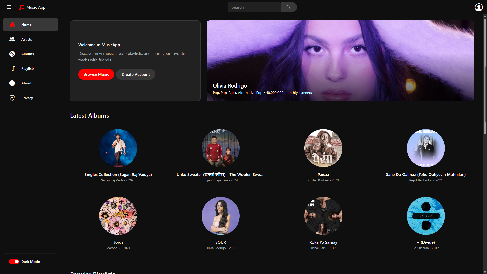
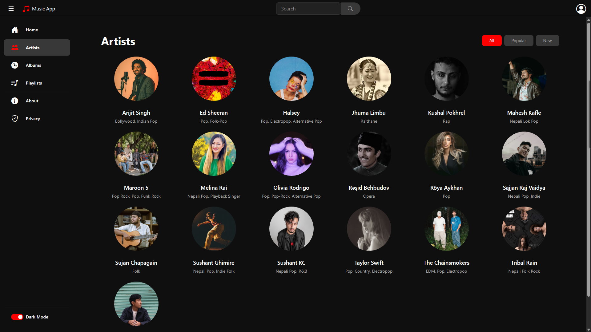
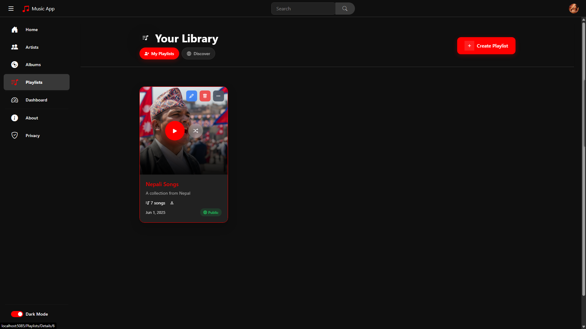
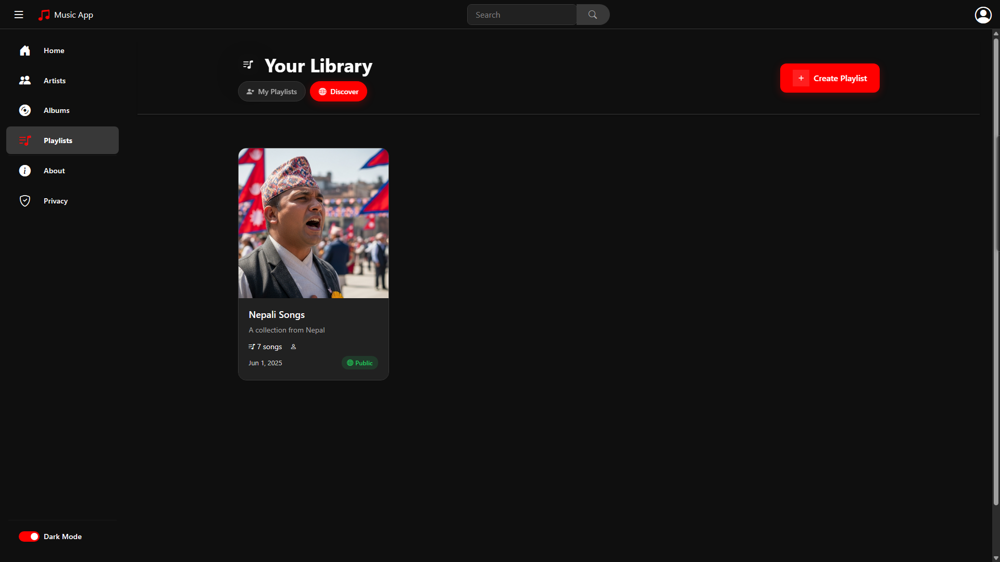
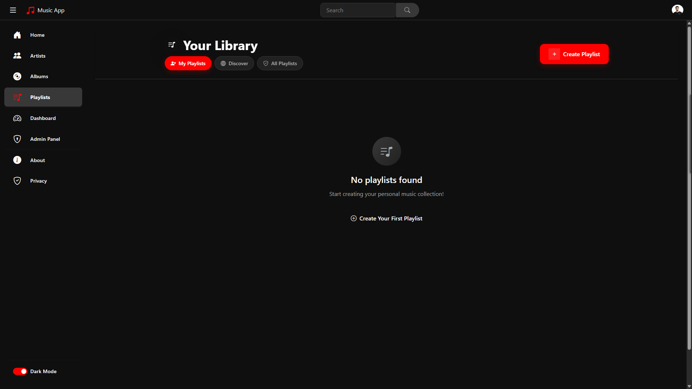
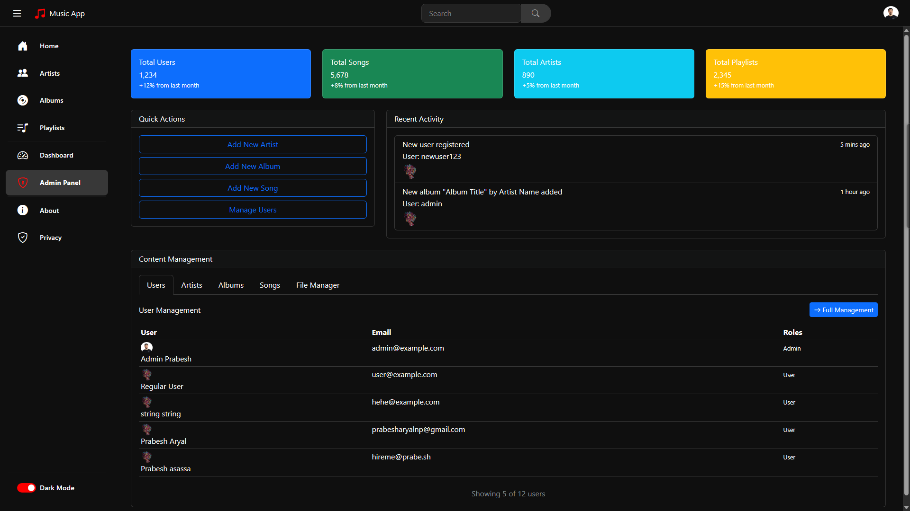
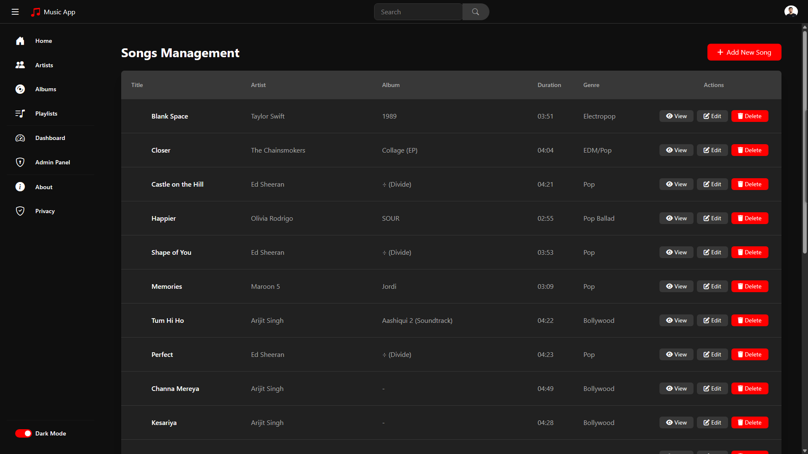

# 🎵 MusicApp - Complete Music Streaming Platform

**MusicApp** is a comprehensive music streaming platform built with **ASP.NET Core 8.0 MVC** that provides a complete music discovery and management experience. This full-featured application includes user authentication, admin management, music playback, playlist creation, and social features.

## 👨‍💻 About the Developer

This Music App is a Computer Science project developed by **Prabesh Aryal** as part of the 3rd year, 2nd semester coursework for the Bachelor of Science in Computer Engineering program at Baku Engineering University (Class 1202i). It was submitted to **Vugar Cebiyev**.

**Developer Information:**
- **Name:** Prabesh Aryal
- **University:** Baku Engineering University
- **Program:** Computer Engineering BSc, Class 1202i
- **Portfolio:** [https://prabe.sh](https://prabe.sh)
- **Email:** [hello@prabe.sh](mailto:hello@prabe.sh)
- **GitHub:** [prabeshAryal](https://github.com/prabeshAryal)

---

## 🚀 Key Features

### 🔐 Authentication & Authorization
- **Secure Authentication System** with Cookie-based authentication and JWT token support
- **Role-Based Access Control** (Admin, User roles)
- **User Registration & Login** with email verification
- **Profile Management** with image upload capabilities
- **Remember Me** functionality for persistent sessions

### 🏠 Public Interface
- **Landing Page** for non-authenticated users with music discovery
  
- **Public Album Browsing** with detailed album views
  
- **Artist Discovery** with comprehensive artist profiles
  
- **Single Album View** with track listings and details
  

### 🎶 Music Playback & Management
- **Advanced Music Player** with play queue functionality
  
- **Song Management** with comprehensive metadata
  
- **Album Collection** with detailed views and organization
- **Artist Management** with bio, genres, and discography

### 📋 Playlist System
- **Personal Playlists** with privacy controls (public/private)
  
- **Public Playlist Management** for community sharing
  
- **Playlist Admin Tools** for content moderation
  

### 👤 User Experience
- **Personal Dashboard** with listening history and recommendations
- **User Profile Management** with customizable bio and profile pictures
  
- **Listening History** tracking with detailed analytics
- **Social Features** including user following and favorites

### ⚙️ Administrative Features
- **Comprehensive Admin Dashboard** with system overview
  
- **User Management System** with role assignment and moderation
- **Content Management** for artists, albums, and songs
  
- **File Upload Management** for audio files and cover images
  
- **Album Administration** with metadata management
  

---

## 🛠️ Technology Stack

### Backend Technologies
- **Framework:** ASP.NET Core 8.0 MVC
- **Database:** Entity Framework Core with In-Memory Database
- **Authentication:** Cookie Authentication + JWT Token Support
- **Language:** C# with .NET 8.0
- **Architecture:** MVC (Model-View-Controller) Pattern

### Frontend Technologies
- **View Engine:** Razor Views (.cshtml)
- **CSS Framework:** Bootstrap 5
- **JavaScript:** jQuery and modern ES6+
- **Responsive Design:** Mobile-first approach

### Key Libraries & Packages
- **Microsoft.EntityFrameworkCore** (8.0.0)
- **Microsoft.EntityFrameworkCore.InMemory** (8.0.0)
- **Microsoft.AspNetCore.Authentication.Cookies**
- **Microsoft.AspNetCore.Http**

---

## 📁 Project Architecture

The application follows a well-structured ASP.NET Core MVC architecture:

```
MusicApp/
├── Controllers/                     # MVC Controllers
│   ├── AccountController.cs         # Authentication & user management
│   ├── AdminFileUploadController.cs # File upload management
│   ├── BaseAppController.cs         # Base controller with common functionality
│   ├── HomeController.cs           # Landing page and general site info
│   ├── ArtistsController.cs        # Artist management and browsing
│   ├── AlbumsController.cs         # Album management and browsing
│   ├── SongsController.cs          # Song management and playback
│   ├── PlaylistsController.cs      # Playlist creation and management
│   └── UsersController.cs          # User administration (Admin only)
├── Models/                         # Data Models
│   ├── User.cs                     # User entity with authentication
│   ├── Role.cs                     # User roles (Admin, User)
│   ├── UserRole.cs                 # Many-to-many user-role relationship
│   ├── UserFollower.cs             # User following system
│   ├── UserFavorite.cs             # User favorites/likes
│   ├── Artist.cs                   # Artist entity
│   ├── Album.cs                    # Album entity
│   ├── Song.cs                     # Song entity with metadata
│   ├── Playlist.cs                 # Playlist entity
│   └── DTOs/                       # Data Transfer Objects
│       ├── CommonDTOs.cs           # Shared DTOs
│       ├── AddSongToPlaylistDto.cs # Playlist operations
│       └── PaginatedResponse.cs    # Pagination support
├── Views/                          # Razor Views
│   ├── Account/                    # Authentication views
│   │   ├── Login.cshtml            # User login page
│   │   ├── Register.cshtml         # User registration
│   │   ├── Dashboard.cshtml        # User dashboard
│   │   ├── AdminDashboard.cshtml   # Admin control panel
│   │   └── ListeningHistory.cshtml # User listening history
│   ├── Home/                       # Public landing pages
│   ├── Artists/                    # Artist browsing and management
│   ├── Albums/                     # Album browsing and management
│   ├── Songs/                      # Song management and playback
│   ├── Playlists/                  # Playlist views
│   ├── Users/                      # User management (Admin)
│   └── Shared/                     # Shared layouts and components
│       ├── _Layout.cshtml          # Main application layout
│       └── Error.cshtml            # Error handling views
├── Services/                       # Business Logic Layer
│   ├── ApiService.cs               # API communication service
│   ├── AuthService.cs              # Authentication service
│   ├── FileUploadService.cs        # File handling service
│   └── ApiSettings.cs              # API configuration
├── Data/                           # Data Access Layer
│   └── ApplicationDbContext.cs     # EF Core database context
├── ViewModels/                     # View Models for data binding
│   ├── LoginViewModel.cs           # Login form model
│   ├── RegisterViewModel.cs        # Registration form model
│   ├── ProfileViewModel.cs         # User profile model
│   ├── HomeViewModel.cs            # Home page model
│   └── ListeningHistoryViewModel.cs # Listening history model
├── Helpers/                        # Utility Classes
│   └── ImageHelper.cs              # Image processing utilities
└── wwwroot/                        # Static Content
    ├── css/                        # Stylesheets
    ├── js/                         # JavaScript files
    ├── lib/                        # Third-party libraries
    └── assets/                     # Images and media files
```

---

## 🚀 Getting Started

### Prerequisites
- **.NET 8.0 SDK** or later
- **Visual Studio 2022** or **Visual Studio Code** with C# extension
- **Git** for version control

### Installation & Setup

1. **Clone the Repository**
   ```bash
   git clone https://github.com/prabeshAryal/MusicApp-Project.git
   cd Music-App-Project/MusicAppFrontend
   ```

2. **Restore Dependencies**
   ```bash
   dotnet restore
   ```

3. **Build the Project**
   ```bash
   dotnet build
   ```

4. **Run the Application**
   ```bash
   dotnet run
   ```

5. **Access the Application**
   - Open your browser and navigate to `https://localhost:5001` or `http://localhost:5000`
   - The application will automatically seed with sample data

### Default Admin Account
For testing admin features, use these credentials:
- **Username:** `admin`
- **Email:** `admin@example.com`
- **Password:** `Admin@123`

---

## 🎯 Core Functionality

### User Management
- **Registration System** with email validation
- **Secure Login** with remember me functionality
- **Profile Management** with image upload
- **Role-based Access Control** (Admin/User)
- **User Following System** for social interaction

### Music Features
- **Music Discovery** with genre-based browsing
- **Advanced Search** across artists, albums, and songs
- **Playlist Creation** with public/private options
- **Music Playback** with queue management
- **Listening History** tracking and analytics
- **Favorites System** for liked content

### Administrative Tools
- **User Management** with role assignment
- **Content Moderation** for all music content
- **File Upload Management** for audio and images
- **System Analytics** and usage statistics
- **Bulk Operations** for efficient content management

---

## 🔧 Development Features

### Authentication & Security
- **Cookie-based Authentication** with JWT token support
- **CSRF Protection** on all forms
- **Role-based Authorization** throughout the application
- **Secure File Upload** with validation
- **Password Hashing** using industry standards

### API Integration
- **RESTful API Design** with proper HTTP methods
- **Pagination Support** for large datasets
- **Error Handling** with user-friendly messages
- **File Upload Service** for media management
- **Standardized Responses** with DTOs

### UI/UX Features
- **Responsive Design** optimized for all devices
- **Modern Bootstrap 5** styling
- **AJAX Operations** for smooth user experience
- **Image Optimization** with fallback handling
- **Progressive Enhancement** for accessibility

---

## 📊 Database Schema

The application uses a comprehensive database schema with the following key entities:

### Core Entities
- **Users** - User accounts with authentication
- **Roles** - User role definitions (Admin, User)
- **Artists** - Music artist information
- **Albums** - Album metadata and relationships
- **Songs** - Individual track information
- **Playlists** - User-created playlists

### Relationship Tables
- **UserRole** - Many-to-many user-role relationships
- **UserFollower** - User following system
- **UserFavorite** - User favorites/likes tracking
- **PlaylistSong** - Playlist-song relationships

For detailed database structure, see: [ER Diagram](misc/ER_Diagram.png)

---

## 🎨 Screenshots & Features

### Public Interface
| Feature | Screenshot |
|---------|------------|
| **Landing Page** |  |
| **Album Browsing** |  |
| **Artist Discovery** |  |
| **Album Details** |  |

### User Features
| Feature | Screenshot |
|---------|------------|
| **Music Player** |  |
| **User Profile** |  |
| **Personal Playlists** |  |
| **Playlist Management** |  |

### Administrative Interface
| Feature | Screenshot |
|---------|------------|
| **Admin Dashboard** |  |
| **Artist Management** |  |
| **Song Administration** |  |
| **Album Management** |  |

---

## 🚧 Future Enhancements

### Planned Features
- **Real-time Music Streaming** with audio file integration
- **Advanced Analytics** for artists and administrators
- **Social Features** including comments and reviews
- **Mobile Application** development
- **API Rate Limiting** and caching improvements
- **External Music Service Integration** (Spotify, Apple Music APIs)
- **Recommendation Engine** based on listening history
- **Live Chat** and messaging system

### Technical Improvements
- **Database Migration** to SQL Server or PostgreSQL
- **Redis Caching** for improved performance
- **Background Jobs** for file processing
- **CDN Integration** for media file delivery
- **OAuth Integration** with social media platforms
- **Progressive Web App (PWA)** capabilities

---

## 📚 Documentation

### Technical Documentation
- **[Entity Relationship Diagram](misc/ER_Diagram.png)** - Complete database schema
- **[ER Diagram Source](misc/ER_Diagram.txt)** - Editable diagram code
- **[Business Logic Summary](misc/Business_Logic_Summary.md)** - Detailed requirements

### Key Documentation Sections
- **Core Entities and Relationships** - Complete data model overview
- **Business Rules and Constraints** - Application logic requirements
- **API Endpoints** - RESTful service documentation
- **Authentication Flow** - Security implementation details
- **File Upload Process** - Media handling procedures

---

## 🤝 Contributing

This project is part of an academic submission, but suggestions and feedback are welcome:

1. **Fork the repository**
2. **Create a feature branch** (`git checkout -b feature/AmazingFeature`)
3. **Commit your changes** (`git commit -m 'Add some AmazingFeature'`)
4. **Push to the branch** (`git push origin feature/AmazingFeature`)
5. **Open a Pull Request**

---

## 📄 License

This project is created for educational purposes as part of the Computer Engineering curriculum at Baku Engineering University.

---

## 📞 Contact & Support

**Developer:** Prabesh Aryal  
**University:** Baku Engineering University  
**Program:** Computer Engineering BSc, Class 1202i  
**Email:** [hello@prabe.sh](mailto:hello@prabe.sh)  
**Portfolio:** [https://prabe.sh](https://prabe.sh)  
**GitHub:** [@prabeshAryal](https://github.com/prabeshAryal)

---

## 🙏 Acknowledgments

- **Vugar Cebiyev** - Course Instructor
- **Baku Engineering University** - Educational Institution
- **ASP.NET Core Team** - Framework Development
- **Bootstrap Team** - UI Framework
- **Entity Framework Team** - ORM Development

---

*Built with ❤️ using ASP.NET Core 8.0 MVC*
