# 🎵 Music App - Complete Music Streaming Platform

A comprehensive, full-stack music streaming platform built with modern ASP.NET Core architecture, featuring advanced music management, social interactions, and administrative tools. This project demonstrates enterprise-level application development with robust security, scalable architecture, and rich user experience.

     

## 📊 Project Statistics

| Component | Details |
|-----------|---------|
| **Total Controllers** | 11+ Backend API Controllers, 7+ Frontend MVC Controllers |
| **Database Models** | 12+ Entity models with complex relationships |
| **API Endpoints** | 50+ RESTful endpoints for comprehensive functionality |
| **Views & Pages** | 30+ Razor views with responsive design |
| **Authentication** | Dual-layer: JWT + Cookie-based with role management |
| **File Management** | Audio upload, image processing, and storage service |
| **Documentation** | 900+ lines of comprehensive LaTeX business logic analysis |

## 🏗️ Project Architecture

### **`MusicAppBackend/`** - Enterprise API Server
- **ASP.NET Core Web API** with comprehensive RESTful endpoints
- **Entity Framework Core** with SQL Server for robust data management
- **JWT Authentication** with refresh token support
- **Role-based Authorization** (Admin, User roles)
- **File Storage Service** for audio and image management
- **Global Exception Handling** and API documentation middleware
- **Database Migrations** and seed data management

### **`MusicAppFrontend/`** - Rich Web Application
- **ASP.NET MVC** with Razor Views for dynamic content rendering
- **Bootstrap 5** with custom CSS for modern, responsive design
- **JavaScript Music Player** with queue management and playlist support
- **AJAX Operations** for seamless user experience
- **Cookie-based Authentication** integrated with backend JWT
- **File Upload** capabilities with image optimization
- **Real-time Notifications** and error handling

### **`TEX/`** - Comprehensive Documentation
- **Business Logic Documentation** in LaTeX format
- **Technical Architecture** analysis and implementation details
- **Academic Submission** materials with professional formatting

## ✨ Advanced Features & Capabilities

### 🔐 **Authentication & Security**
- **Dual Authentication System**: JWT tokens + Cookie-based sessions
- **Secure Password Hashing** with industry-standard algorithms
- **Role-Based Access Control** with granular permissions
- **CSRF Protection** on all forms and AJAX requests
- **Input Validation & Sanitization** across all endpoints
- **Secure File Upload** with type validation and size limits

### 🎶 **Music Management System**
- **Advanced Music Player** with playlist queue functionality
- **Audio File Management** with metadata extraction
- **Album & Artist Management** with rich media support
- **Genre-based Organization** and discovery features
- **Play Count Tracking** and listening analytics
- **Cover Art Management** with automatic fallbacks

### 📋 **Playlist Ecosystem**
- **Personal Playlists** with public/private visibility controls
- **Collaborative Features** with playlist sharing and copying
- **Dynamic Song Management** (add, remove, reorder tracks)
- **Search Integration** for easy song discovery and addition
- **Shuffle & Repeat Modes** with advanced playback controls
- **Playlist Analytics** and engagement tracking

### 👥 **Social Platform Features**
- **User Following System** for artist and user connections
- **Favorites & Likes** for content curation
- **Activity Tracking** and listening history
- **User Profiles** with customizable bios and profile images
- **Social Discovery** of music through community interactions

### ⚙️ **Administrative Dashboard**
- **Comprehensive Admin Panel** with system overview
- **User Management** with role assignment and moderation tools
- **Content Moderation** for all music and user-generated content
- **System Analytics** and usage statistics
- **Bulk Operations** for efficient content management
- **File Storage Monitoring** and cleanup utilities

## 🛠️ Technology Stack

### **Backend Technologies**
- **ASP.NET Core 6.0+** - High-performance web API framework
- **Entity Framework Core** - Advanced ORM with LINQ support
- **SQL Server** - Enterprise-grade relational database
- **JWT Authentication** - Stateless token-based security
- **AutoMapper** - Object-to-object mapping
- **Serilog** - Structured logging framework

### **Frontend Technologies**
- **ASP.NET MVC** - Model-View-Controller web framework
- **Razor Views** - Server-side rendering with C# integration
- **Bootstrap 5** - Modern responsive CSS framework
- **jQuery** - JavaScript library for DOM manipulation
- **Custom JavaScript** - Music player and AJAX functionality
- **CSS3 & HTML5** - Modern web standards

### **Development Tools**
- **Visual Studio/VS Code** - Development environment
- **SQL Server Management Studio** - Database administration
- **Entity Framework Migrations** - Database versioning
- **LaTeX** - Professional documentation generation
- **Git** - Version control system

## 🚀 Quick Start Guide

### **Prerequisites**
```bash
# Required Software
- .NET 6.0+ SDK
- SQL Server (LocalDB or full instance)
- Git (for source control)
```

### **Installation Steps**

1. **Clone the Repository**
   ```bash
   git clone <repository-url>
   cd Music-App-Project
   ```

2. **Backend Setup**
   ```bash
   cd MusicAppBackend
   # Update connection string in appsettings.json
   dotnet restore
   dotnet ef database update
   dotnet run
   ```

3. **Frontend Setup**
   ```bash
   cd MusicAppFrontend
   # Update connection string in appsettings.json
   dotnet restore
   dotnet run
   ```

### **Default Access**
- **Frontend Application**: `http://localhost:5000`
- **Backend API**: `http://localhost:5117`
- **Admin Account**: Created during database seeding
- **API Documentation**: Available at `/api/docs` endpoint

## 📊 Database Schema & Architecture

### **Core Entities**
- **Users** - Authentication, profiles, and social features
- **Artists** - Musician profiles and metadata
- **Albums** - Music collection organization
- **Songs** - Individual track management with metadata
- **Playlists** - User-created music collections
- **Roles** - Permission-based access control

### **Relationship Management**
- **Many-to-Many**: Songs ↔ Artists, Users ↔ Playlists
- **One-to-Many**: Users → Playlists, Albums → Songs
- **Advanced Relations**: Following, Favorites, Play History

### **Data Integrity Features**
- **Foreign Key Constraints** ensuring referential integrity
- **Cascade Deletion** for dependent entities
- **Unique Constraints** on critical fields
- **Index Optimization** for query performance

## 🎨 Features Showcase

### **Public Interface**
- **Landing Page**: Modern homepage for non-authenticated users
  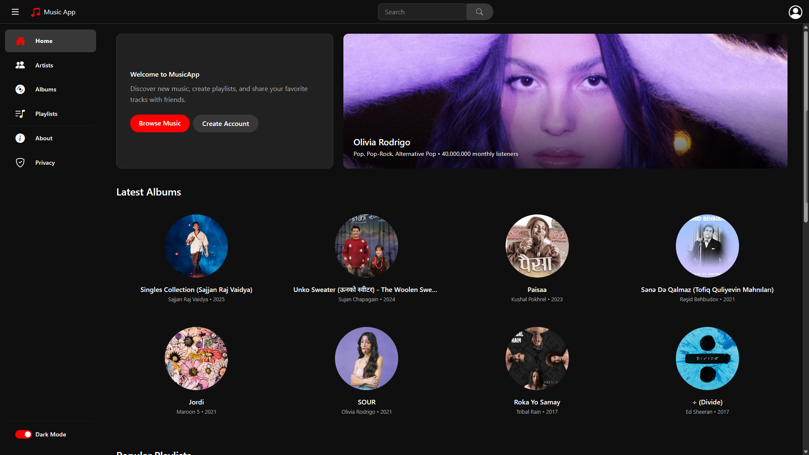
- **Public Albums**: Browse music collections with detailed views
  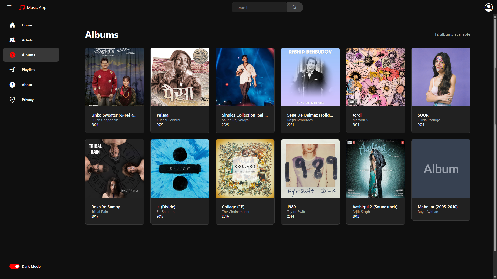
- **Artist Discovery**: Comprehensive artist profiles and discographies
  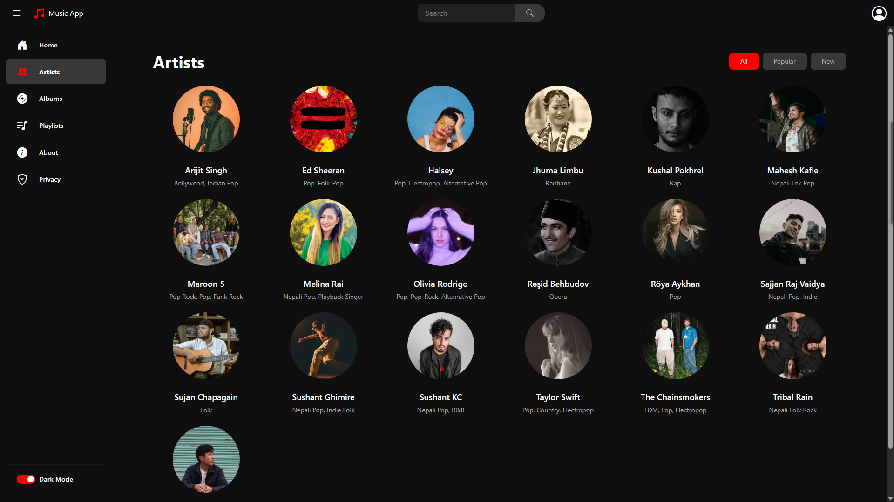
- **Album Details**: Individual album pages with track listings
  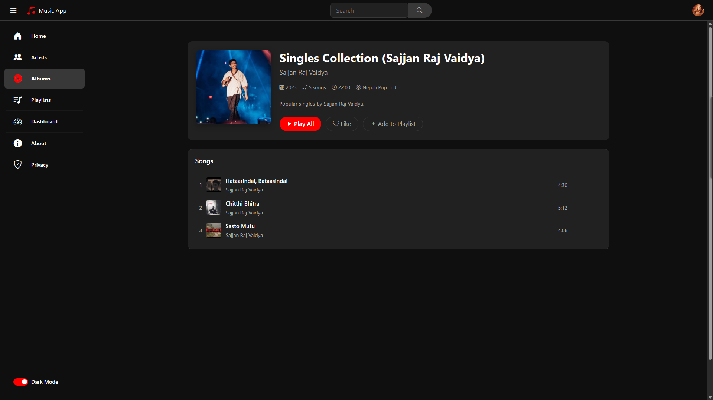

### **User Dashboard**
- **Music Player**: Advanced playback with queue management
  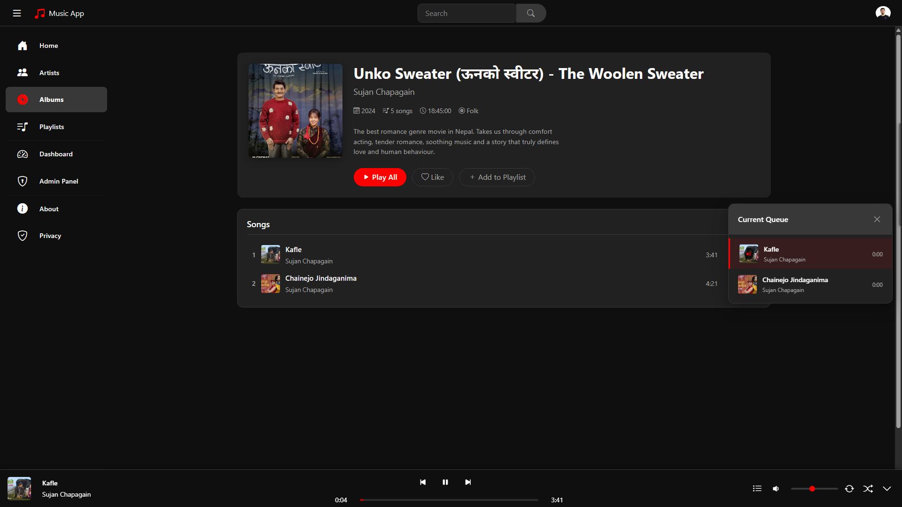
- **User Profile**: Customizable profiles with bio and image management
  
- **Personal Playlists**: Create and manage private music collections
  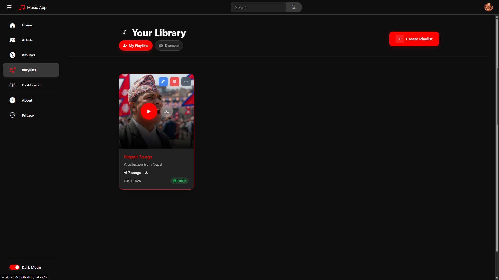
- **Public Playlist Management**: Share and collaborate on music collections
  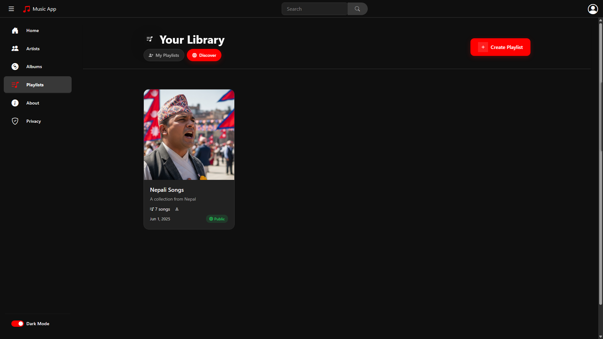

### **Administrative Interface**
- **Admin Dashboard**: Comprehensive system overview and management
  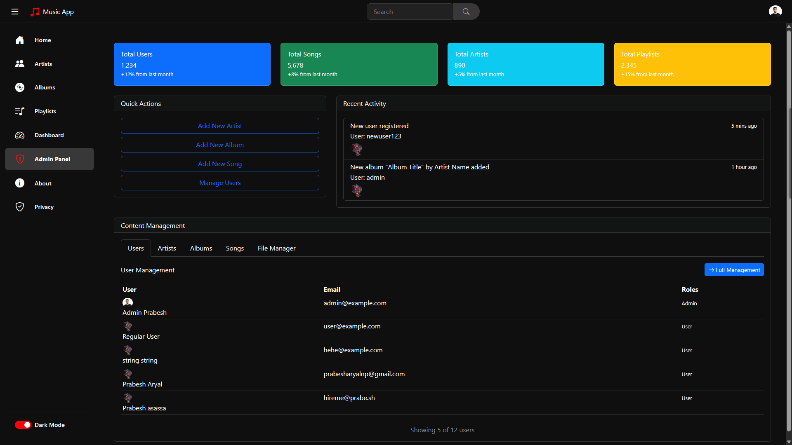
- **Artist Management**: Moderate and manage artist profiles
  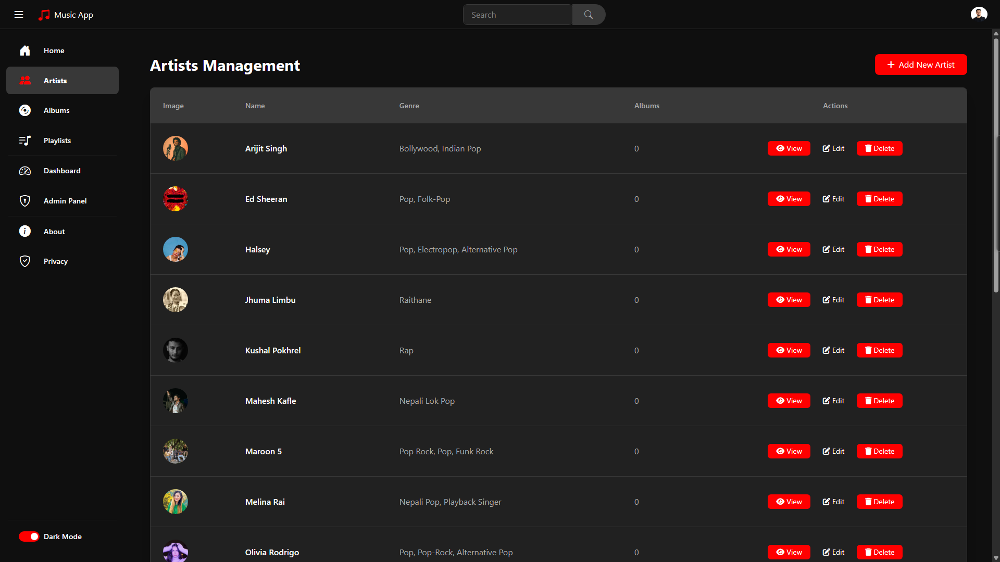
- **Song Administration**: Bulk operations for music content
  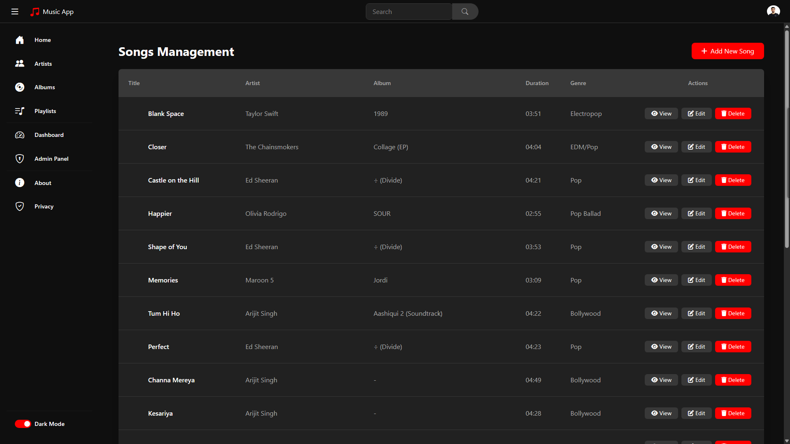
- **Album Management**: Complete album lifecycle management
  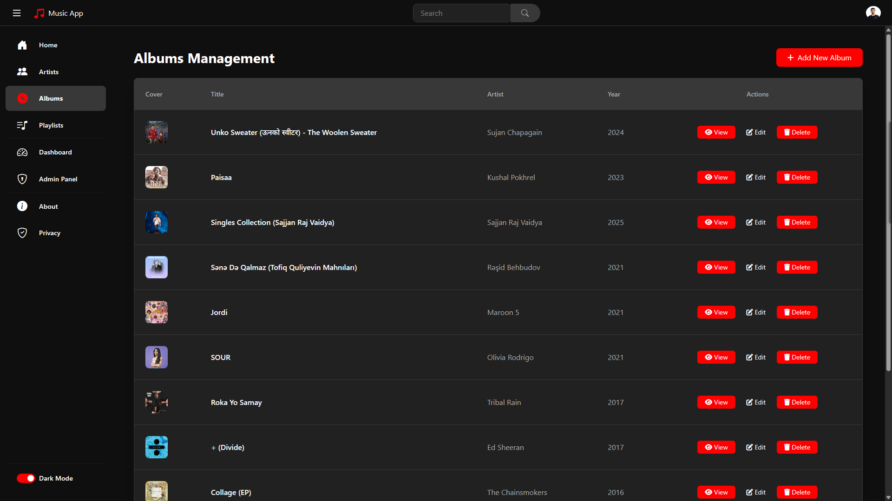
- **Playlist Administration**: Moderate user-generated playlists
  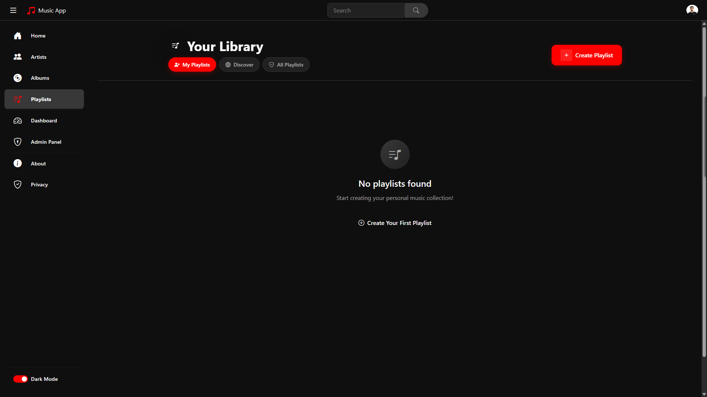

## 🔧 Configuration & Deployment

### **Environment Configuration**
```json
{
  "ConnectionStrings": {
    "DefaultConnection": "Server=(localdb)\\mssqllocaldb;Database=MusicAppDb;Trusted_Connection=true;MultipleActiveResultSets=true"
  },
  "JwtSettings": {
    "SecretKey": "your-secret-key",
    "Issuer": "MusicApp",
    "Audience": "MusicAppUsers",
    "ExpiryMinutes": 60
  }
}
```

### **Production Deployment**
- **IIS Integration** for Windows Server deployment
- **Docker Support** for containerized deployment
- **SQL Server** production database configuration
- **File Storage** configuration for media files
- **HTTPS/SSL** certificate integration

## 🧪 Development Features

### **Testing & Quality Assurance**
- **Data Validation** at multiple layers
- **Error Handling** with user-friendly messages
- **Logging Integration** for debugging and monitoring
- **Performance Optimization** with efficient queries

### **Security Implementations**
- **Input Sanitization** preventing injection attacks
- **CORS Configuration** for secure API access
- **Rate Limiting** for API endpoint protection
- **File Upload Security** with type and size validation

## 📚 Documentation

The project includes comprehensive documentation across multiple formats:

### **Technical Documentation**
- **[`README.md`](README.md)** (this file): Complete project overview and setup guide
- **[`MusicAppBackend/README.md`](MusicAppBackend/README.md)**: Detailed backend API documentation with endpoints
- **[`MusicAppFrontend/readme.md`](MusicAppFrontend/readme.md)**: Frontend-specific features and implementation details

### **Academic Documentation** 
- **`TEX/business_logic_documentation.tex`**: Comprehensive business logic analysis in LaTeX format
- **`TEX/submission.tex`**: Academic submission materials with professional formatting

### **Visual Documentation**
- **`MusicAppFrontend/misc/ER_Diagram.png`**: Entity Relationship diagram showing database structure
- **`MusicAppFrontend/misc/screenshots/`**: Application screenshots demonstrating key features

### **Configuration Files**
- **Database connection strings** in `appsettings.json` files
- **Launch profiles** for development and production environments
- **Entity Framework migrations** for database versioning

---

## 🎓 Academic Information

**Project Details:**
- **Course:** Modern Programming Language - 2
- **Institution:** Baku Engineering University
- **Developer:** Prabesh Aryal 
- **Program:** Computer Engineering, Class 1202i
- **Submission Date:** June 2, 2025

**Contact Information:**
- **Portfolio:** https://prabe.sh
- **Email:** hello@prabe.sh

---
