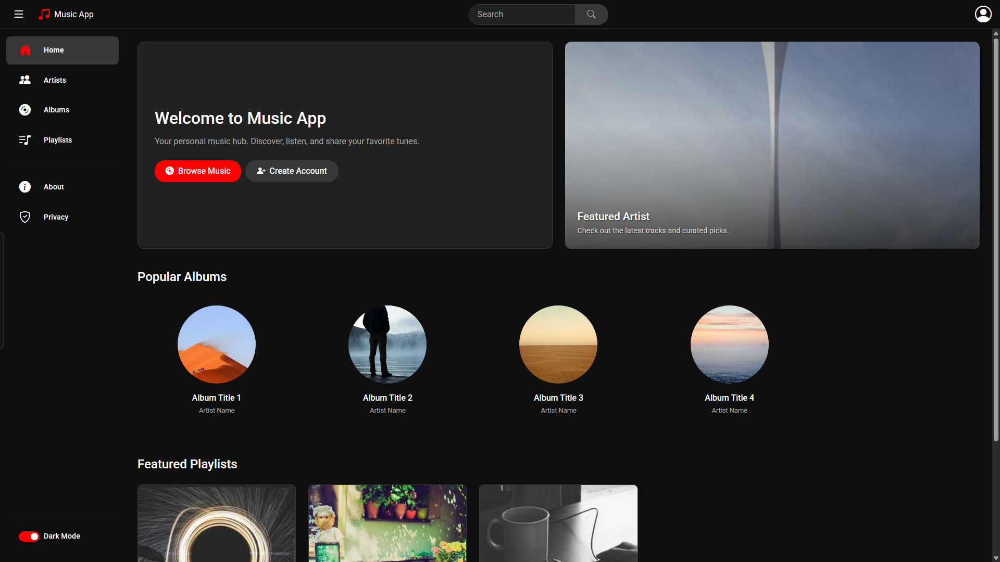
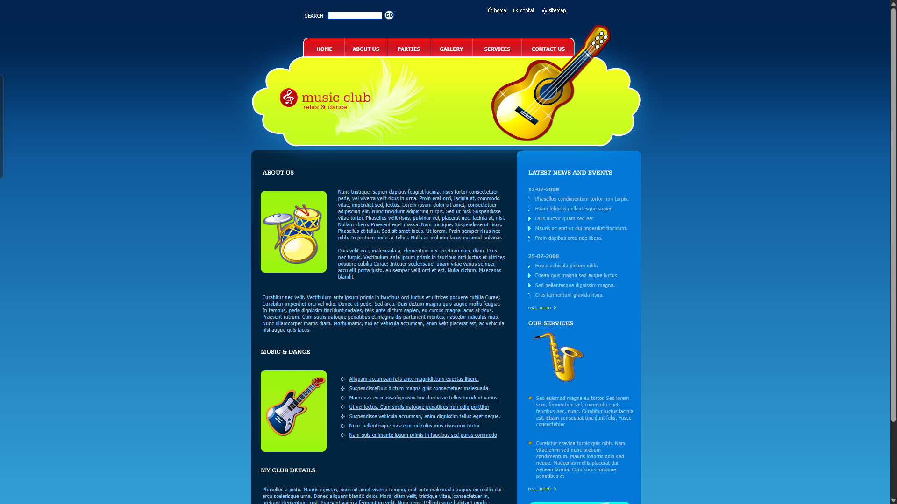
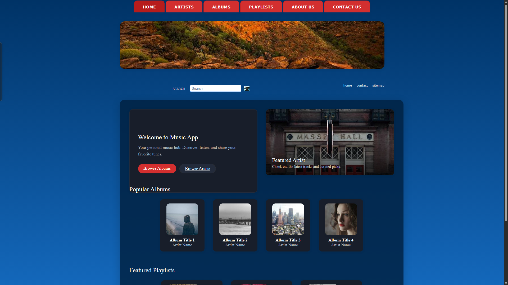
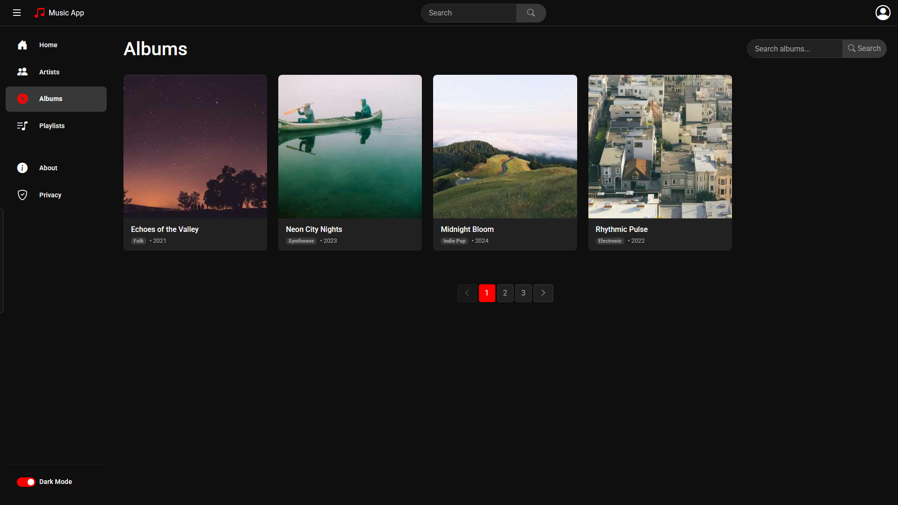
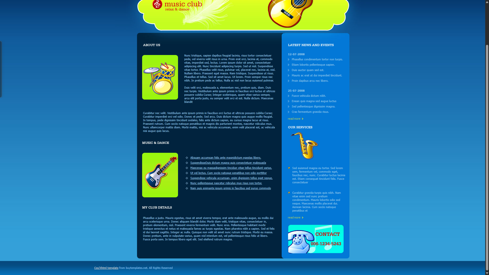
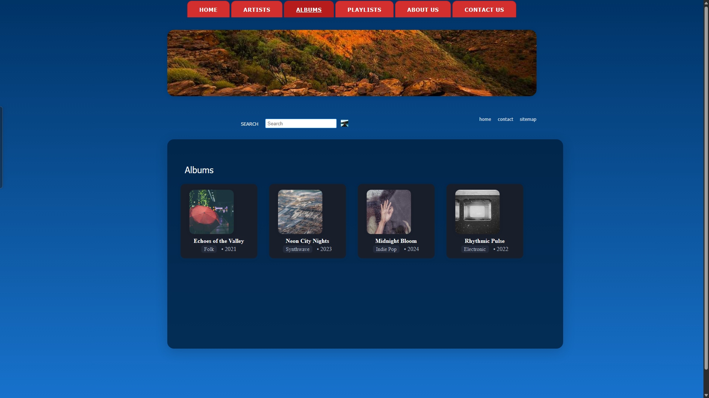

# Music Library Project

This project is a modern music library web application built with ASP.NET Core MVC. It features a dark theme, dynamic images, and a responsive, user-friendly layout for browsing albums, artists, and playlists.

## Visual Comparison: Before, Template, and After

Below is a visual comparison of the Albums page before changes, the provided template, and the final result after applying the new design and code updates as per instructor feedback.

| Before (Old Design) | Template (Reference) | After (Updated Design) |
|---------------------|---------------------|------------------------|
|  |  |  |
|  |  |  |

- **Before:** Shows the original Albums page before any changes.
- **Template:** Shows the design reference provided by the instructor.
- **After:** Shows the Albums page after applying the new layout, theme, and code improvements.

## Theme Reference
This project uses and adapts the visual style and layout from the [Music Club free CSS template](https://www.free-css.com/free-css-templates/page103/music-club).

## Key Improvements
- Modern dark theme using CSS variables and consistent styling.
- Responsive card/grid layout for albums, matching the template.
- Improved alignment, spacing, and visual clarity.
- Footer now sticks to the bottom of the page.
- All screenshots are located in the `misc/screenshots/` directory.

---

For more details, see the code and comments in the `Views/Albums/Index.cshtml` file.
